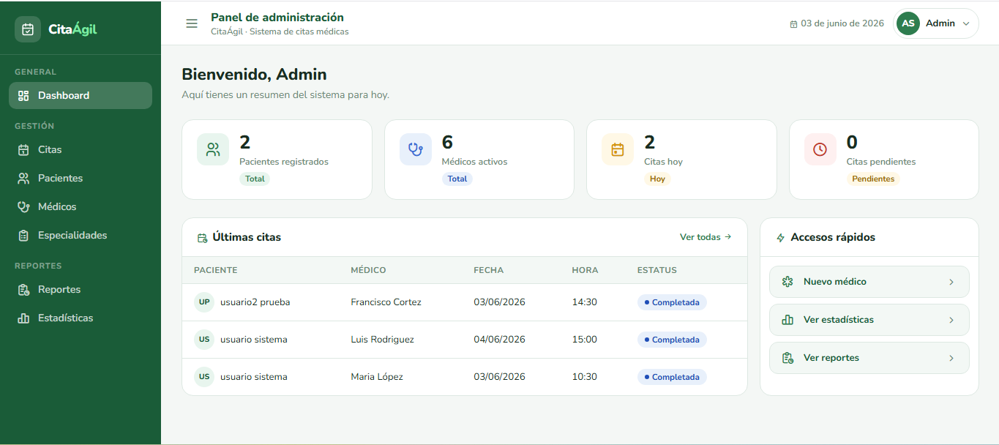
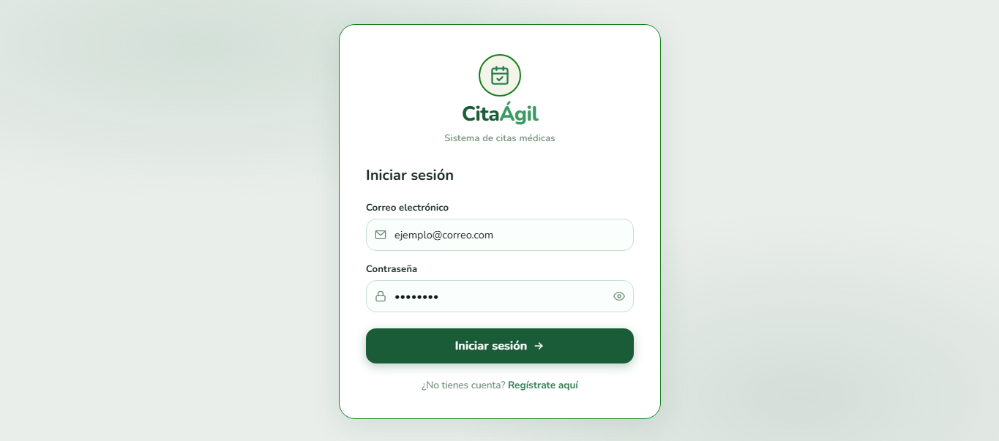
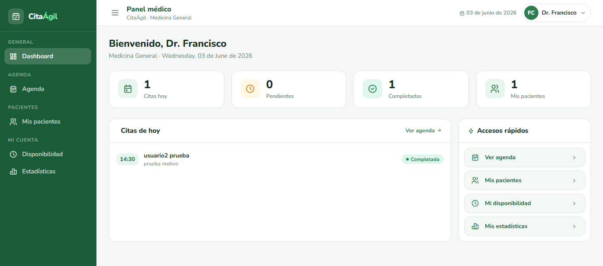

# CitaÁgil — Sistema de Citas Médicas

<p align="center">
  
</p>

<p align="center">
  
  
  
  
</p>

---

## 📽️ Demo

> Haz clic en la imagen para ver el video de demostración completo.

[](https://www.youtube.com/watch?v=wR5YsastvQo)

---

## 📋 Descripción

**CitaÁgil** es un sistema web de gestión de citas médicas desarrollado en PHP con arquitectura MVC ligera. Permite a pacientes agendar citas con médicos según disponibilidad, a médicos gestionar su agenda y agregar notas de consulta, y a administradores supervisar y gestionar todo el sistema.

---

## 🎯 Objetivo

Desarrollar una plataforma digital que simplifique y optimice el proceso de agendamiento de citas médicas, eliminando la necesidad de llamadas telefónicas o filas de espera, ofreciendo una experiencia intuitiva para los tres roles del sistema: **Administrador**, **Médico** y **Paciente**.

---

## ✨ Características principales

### 👤 Panel del Administrador
- Dashboard con estadísticas en tiempo real
- Gestión de pacientes (listar, activar/desactivar)
- Gestión de médicos (crear, listar, activar/desactivar)
- Gestión de especialidades (CRUD completo)
- Historial completo de citas con filtros
- Reportes exportables a CSV por fecha, médico y especialidad
- Estadísticas visuales con gráficas (Chart.js)
- Configuración del sistema (horario de atención, duración de citas, días laborables)
- Perfil del administrador con cambio de contraseña

### 🩺 Panel del Médico
- Dashboard con resumen del día
- Agenda diaria, semanal y en lista
- Confirmación, completado y cancelación de citas
- Gestión de pacientes atendidos con historial
- Notas de consulta por paciente
- Configuración de disponibilidad semanal y fechas bloqueadas
- Estadísticas propias (citas por mes, estatus, top pacientes, rendimiento por día)

### 🙋 Panel del Paciente
- Página de inicio con notificaciones de citas del día/mañana
- Búsqueda de médicos por especialidad en 4 pasos
- Agendado de citas con validación de disponibilidad y slots
- Gestión de citas: ver, cancelar y reprogramar
- Historial médico con notas de consulta del médico

---

## 🛠️ Tecnologías utilizadas

| Tecnología | Uso |
|------------|-----|
| **PHP 8.3** | Backend y lógica del servidor |
| **MySQL 8.0** | Base de datos relacional |
| **PDO** | Conexión segura a la base de datos |
| **Apache (WAMP)** | Servidor web local |
| **HTML5 / CSS3** | Estructura y estilos |
| **JavaScript (Vanilla)** | Interactividad del frontend |
| **Chart.js 4.4** | Gráficas y estadísticas |
| **Tabler Icons** | Iconografía del sistema |
| **Nunito (Google Fonts)** | Tipografía |

---

## 🗂️ Estructura del proyecto

```
CitaAgil1/
├── assets/
│   ├── css/
│   │   ├── auth.css
│   │   ├── admin/
│   │   ├── medico/
│   │   └── paciente/
|   ├──images/
|   |   
│   └── js/
│       ├── auth.js
│       ├── admin/
│       ├── medico/
│       └── paciente/
├── config/
│   └── db.php
├── includes/
│   ├── auth.php
│   ├── logout.php
│   ├── admin/
│   │   └── layout.php
│   ├── medico/
│   │   └── layout.php
│   └── paciente/
│       └── layout.php
├── pages/
│   ├── login.php
│   ├── register.php
│   ├── admin/
│   │   ├── dashboard.php
│   │   ├── citas.php
│   │   ├── pacientes.php
│   │   ├── medicos.php
│   │   ├── especialidades.php
│   │   ├── reportes.php
│   │   ├── estadisticas.php
│   │   └── configuracion.php
│   ├── medico/
│   │   ├── dashboard.php
│   │   ├── agenda.php
│   │   ├── pacientes.php
│   │   ├── disponibilidad.php
│   │   └── estadisticas.php
│   └── paciente/
│       ├── inicio.php
│       ├── buscar.php
│       ├── citas.php
│       └── historial.php
├── index.php
└── README.md
```

---

## 🗄️ Base de datos

El sistema utiliza las siguientes tablas:

| Tabla | Descripción |
|-------|-------------|
| `usuarios` | Usuarios del sistema (admin, médico, paciente) |
| `medicos` | Información específica del médico (especialidad, cédula) |
| `especialidades` | Especialidades médicas disponibles |
| `citas` | Registro de citas agendadas |
| `notas_consulta` | Notas del médico por consulta |
| `disponibilidad_medico` | Horario semanal de cada médico |
| `excepciones_disponibilidad` | Fechas bloqueadas por médico |
| `configuracion` | Configuración global del sistema |

---

## ⚙️ Instalación

### Requisitos previos
- WAMP, XAMPP o Laragon instalado
- PHP 8.1 o superior
- MySQL 8.0 o superior

### Pasos

**1. Clonar el repositorio**
```bash

```

**2. Mover a la carpeta del servidor**
```
C:/wamp64/www/CitaAgil1
```

**3. Importar la base de datos**

Abre MySQL Workbench o phpMyAdmin y ejecuta el archivo:
```
citaagil.sql
```

**4. Configurar la conexión**

Copia config/db.example.php → config/db.php y edita tus credenciales.

**5. Acceder al sistema**
```
http://localhost/CitaAgil1
```

---

## 👥 Usuarios de prueba

| Rol | Correo | Contraseña |
|-----|--------|------------|
| Administrador | admin@citaagil.com | admin123 |
| Médico Cardiologo| maria.lopez@gmail.com | MARIALOPEZ |
| Médico General| luis@gmail.com | luisrodriguez |
| Médico General| francisco@gmail.com | francisco |
| Médico Pedriatra| ignacio@gmail.com | ignaciocepeda |
| Médico Ginecologo| ana@gmail.com | anamartinez |
| Médico Dermatologo| carlos@gmail.com | carloshernandez |
| Paciente/usuario | usuario@gmail.com | usuario123 |
| Paciente/usuario | usuario2@gmail.com | usuario2 |

---

## 🔐 Seguridad

- Contraseñas hasheadas con `password_hash()` (bcrypt)
- Sesiones PHP con protección por rol
- Consultas preparadas con PDO (prevención de SQL Injection)
- Validación de datos tanto en frontend como en backend
- Protección de rutas con `requireRole()`

---

## 📸 Capturas de pantalla

> Reemplaza las imágenes con capturas reales de tu sistema.

| Login | Dashboard Admin | Agenda Médico |
|-------|----------------|---------------|
|  |  |  |
